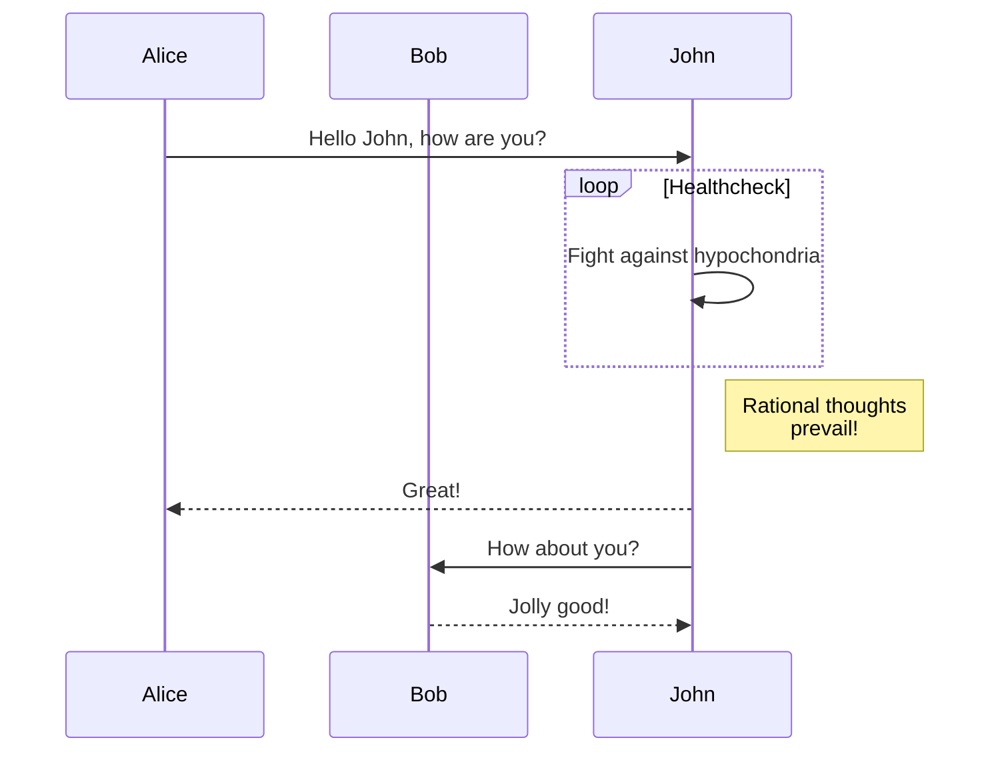

<p align="center">
  <a href="https://github.com/nschloe/docvance"></a>
  <p align="center">Advance GitHub pages with support for LaTeX, plotly, etc.</p>
</p>

[](https://github.com/nschloe/docvance/actions?query=workflow%3Aci)
[](https://github.com/prettier/prettier)

docvance is a browser extension for Google Chrome that lets you use various add-ons on
GitHub READMEs, issues, wikis etc. The add-ons currently are

 * [KaTeX](https://katex.org/) for LaTeX mathematics
 * [Chart.js](https://www.chartjs.org/) for charts
 * [Plotly](https://plotly.com/) for graphing
 * [Mermaid](https://mermaid-js.github.io/mermaid/#/) for diagrams

See [below][#Math] or [the Wiki](https://github.com/nschloe/docvance/wiki/%60%60%60math)
for examples.

Simply install the extension from the

  * [Chrome Web Store](https://chrome.google.com/webstore/detail/docvance/)

and enjoy.

### Math

Let $`U`$ be an open subset of the complex plane $`\mathbb{C}`$, and suppose the closed
disk $`D`$ defined as
```math
D = \bigl\{z:|z-z_{0}|\leq r\bigr\}
```
is completely contained in $`U`$. Let $`f: U\to\mathbb{C}`$ be a holomorphic function,
and let $`\gamma`$ be the circle, oriented counterclockwise, forming the boundary of
$`D`$.  Then for every $`a`$ in the interior of $`D`$,
```math
f(a) = \frac{1}{2\pi i} \oint _{\gamma}\frac{f(z)}{z-a} dz.
```

#### Chart.js
Use `chartjs` language blocks with the chart config as JSON and optionally canvas
attributes,
````markdown
```chartjs
{
  "config": { ... },
  "canvas": { ... }
}
```
````
e.g.,
```chartjs
{
  "config": {
    "type": "line",
    "data": {
      "labels": [1500,1600,1700,1750,1800,1850,1900,1950,1999,2050],
      "datasets": [{
          "data": [86,114,106,106,107,111,133,221,783,2478],
          "label": "Africa",
          "borderColor": "#3e95cd",
          "fill": false
        }, {
          "data": [282,350,411,502,635,809,947,1402,3700,5267],
          "label": "Asia",
          "borderColor": "#8e5ea2",
          "fill": false
        }, {
          "data": [168,170,178,190,203,276,408,547,675,734],
          "label": "Europe",
          "borderColor": "#3cba9f",
          "fill": false
        }, {
          "data": [40,20,10,16,24,38,74,167,508,784],
          "label": "Latin America",
          "borderColor": "#e8c3b9",
          "fill": false
        }, {
          "data": [6,3,2,2,7,26,82,172,312,433],
          "label": "North America",
          "borderColor": "#c45850",
          "fill": false
        }
      ]
    },
    "options": {
      "title": {
        "display": true,
        "text": "World population per region (in millions)"
      }
    }
  }
}
```

#### Plotly
Use `plotly` language blocks with the plot config as JSON
````markdown
```chartjs
{
  "data": [ ... ],
  "layout": { ... }
}
```
````
e.g.,
```plotly
{
  "data": [
    {
      "line": {"shape": "linear"},
      "mode": "lines+markers",
      "name": "linear",
      "type": "scatter",
      "x": [1, 2, 3, 4, 5],
      "y": [1, 3, 2, 3, 1],
      "hoverinfo": "name"
    },
    {
      "line": {"shape": "spline"},
      "mode": "lines+markers",
      "name": "spline",
      "type": "scatter",
      "x": [1, 2, 3, 4, 5],
      "y": [6, 8, 7, 8, 6],
      "text": ["tweak line smoothness<br>with 'smoothing' in line object"],
      "hoverinfo": "text+name"
    },
    {
      "line": {"shape": "vhv"},
      "mode": "lines+markers",
      "name": "vhv",
      "type": "scatter",
      "x": [1, 2, 3, 4, 5],
      "y": [11, 13, 12, 13, 11],
      "hoverinfo": "name"
    },
    {
      "line": {"shape": "hvh"},
      "mode": "lines+markers",
      "name": "hvh",
      "type": "scatter",
      "x": [1, 2, 3, 4, 5],
      "y": [16, 18, 17, 18, 16],
      "hoverinfo": "name"
    },
    {
      "line": {"shape": "vh"},
      "mode": "lines+markers",
      "name": "vh",
      "type": "scatter",
      "x": [1, 2, 3, 4, 5],
      "y": [21, 23, 22, 23, 21],
      "hoverinfo": "name"
    },
    {
      "line": {"shape": "hv"},
      "mode": "lines+markers",
      "name": "hv",
      "type": "scatter",
      "x": [1, 2, 3, 4, 5],
      "y": [26, 28, 27, 28, 26],
      "hoverinfo": "name"
    }
  ],
  "layout": {
    "legend": {
      "y": 0.5,
      "font": {"size": 16},
      "traceorder": "reversed"
    }
  }
}
```

#### Mermaid

Use `mermaid` language blocks with the config, e.g.,


### Development

#### Build instructions

To build the production zip, simply install the dependencies (`npm ci`), then run
```
npm run build
```
or
```
npm run watch
```
The unpacked development version of the extension will then be in `dist/`. Open Google
Chrome, go to `chrome://extensions` and `Load unpacked` this directory. Reload as
necessary.


### More module ideas

 * [D3.js](https://d3js.org/)
   Cannot be configured from a data file, but needs actual (user-provided) JS to be
   `eval()`d - a no-go for extensions.

### License
This software is published under the [GPLv3
license](https://www.gnu.org/licenses/gpl-3.0.en.html).
